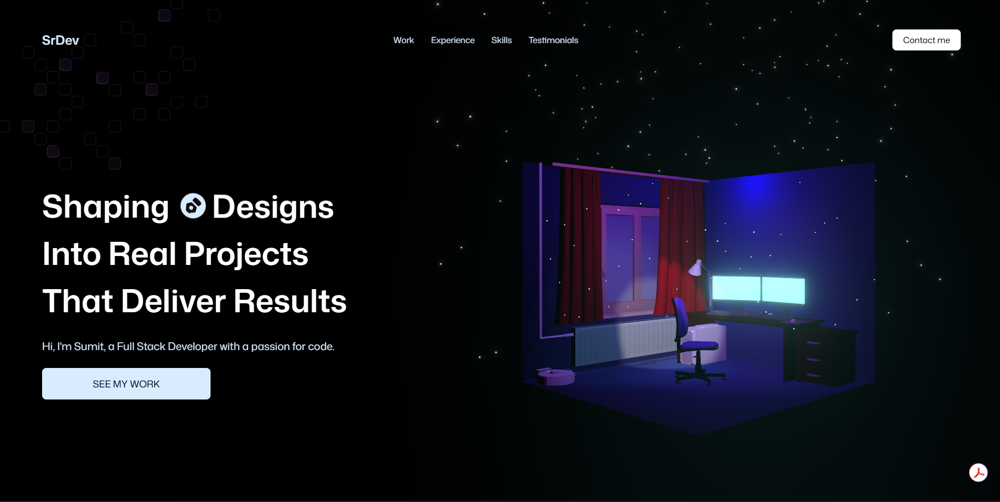
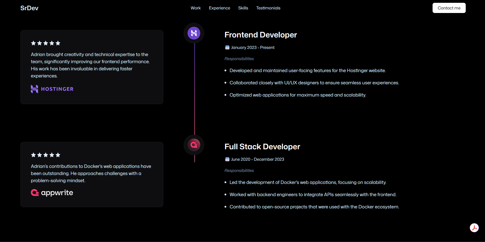

# SrDevFolio

A modern portfolio website built with React, Vite, Tailwind CSS, and Three.js. This project showcases a creative developer portfolio with animated sections, 3D models, and an interactive experience.

## Project Screenshots





## Overview

SrDevFolio is a polished single-page portfolio website designed to present a developer’s skills, experience, projects, testimonials, and contact information in a visually engaging way. The UI includes animated counters, glowing cards, 3D scenes, and responsive sections for a modern presentation.

## Tech Stack

### Core Technologies

- React 19
- Vite 8
- JavaScript (ESM)
- Tailwind CSS 4
- Three.js
- React Three Fiber
- React Three Drei
- GSAP
- ESLint

### Main Packages and Modules

- react
- react-dom
- @vitejs/plugin-react
- tailwindcss
- @tailwindcss/vite
- three
- @react-three/fiber
- @react-three/drei
- @react-three/postprocessing
- gsap
- @gsap/react
- @emailjs/browser
- react-responsive
- eslint
- eslint-plugin-react-hooks
- eslint-plugin-react-refresh

## Prerequisites

Before building this project, make sure you have the following installed:

- Node.js 18 or higher
- npm 9 or higher
- A modern web browser

## Step-by-Step Build Instructions

### 1. Clone the repository

```bash
git clone <your-repository-url>
cd SrDevFolio
```

### 2. Install dependencies

```bash
npm install
```

### 3. Start the development server

```bash
npm run dev
```

Then open the local URL shown in the terminal, usually:

```text
http://localhost:5173/
```

### 4. Build for production

```bash
npm run build
```

This creates a production-ready build in the `dist/` folder.

### 5. Preview the production build locally

```bash
npm run preview
```

### 6. Lint the project

```bash
npm run lint
```

## Project Structure

```text
SrDevFolio/
├─ .gitignore
├─ eslint.config.js
├─ index.html
├─ package.json
├─ package-lock.json
├─ README.md
├─ vite.config.js
├─ Computer-optimized.jsx
├─ public/
│  ├─ images/
│  │  ├─ logos/
│  │  │  ├─ company-logo-1.png
│  │  │  ├─ company-logo-2.png
│  │  │  ├─ company-logo-3.png
│  │  │  ├─ company-logo-4.png
│  │  │  ├─ company-logo-5.png
│  │  │  ├─ company-logo-6.png
│  │  │  ├─ company-logo-7.png
│  │  │  ├─ company-logo-8.png
│  │  │  ├─ company-logo-9.png
│  │  │  ├─ company-logo-10.png
│  │  │  ├─ company-logo-11.png
│  │  │  ├─ git.svg
│  │  │  ├─ node.png
│  │  │  ├─ python.svg
│  │  │  ├─ react.png
│  │  │  └─ three.png
│  │  ├─ textures/
│  │  │  └─ mat1.png
│  │  ├─ arrow-down.svg
│  │  ├─ arrow-right.svg
│  │  ├─ bg.png
│  │  ├─ chat.png
│  │  ├─ code.svg
│  │  ├─ concepts.svg
│  │  ├─ client1.png
│  │  ├─ client2.png
│  │  ├─ client3.png
│  │  ├─ client4.png
│  │  ├─ client5.png
│  │  ├─ client6.png
│  │  ├─ designs.svg
│  │  ├─ devices.png
│  │  ├─ exp1.png
│  │  ├─ exp2.png
│  │  ├─ exp3.png
│  │  ├─ fav.png
│  │  ├─ fb.png
│  │  ├─ gold-star.png
│  │  ├─ ideas.svg
│  │  ├─ insta.png
│  │  ├─ jsm-logo.png
│  │  ├─ linkedin.png
│  │  ├─ logo1.png
│  │  ├─ logo2.png
│  │  ├─ logo3.png
│  │  ├─ menu.svg
│  │  ├─ person.png
│  │  ├─ project1.png
│  │  ├─ project2.png
│  │  ├─ project3.png
│  │  ├─ readme.png
│  │  ├─ readme-bottom.png
│  │  ├─ screen.mp4
│  │  ├─ seo.png
│  │  ├─ star.png
│  │  ├─ time.png
│  │  ├─ x.png
│  │  └─ x.svg
│  └─ models/
│     ├─ computer-optimized.glb
│     ├─ computer-optimized-transformed.glb
│     ├─ git-svg-transformed.glb
│     ├─ node-transformed.glb
│     ├─ optimized-room.glb
│     ├─ python-transformed.glb
│     ├─ react_logo-transformed.glb
│     └─ three.js-transformed.glb
├─ src/
│  ├─ App.jsx
│  ├─ index.css
│  ├─ main.jsx
│  ├─ components/
│  │  ├─ AnimatedCounter.jsx
│  │  ├─ Button.jsx
│  │  ├─ ExpContent.jsx
│  │  ├─ GlowCard.jsx
│  │  ├─ NavBar.jsx
│  │  ├─ TitleHeader.jsx
│  │  └─ Models/
│  │     ├─ contact/
│  │     │  ├─ Computer.jsx
│  │     │  └─ ContactExp.jsx
│  │     └─ room/
│  │        ├─ HeroExperience.jsx
│  │        ├─ Particles.jsx
│  │        ├─ Room.jsx
│  │        ├─ RoomLights.jsx
│  │        └─ techLogos/
│  │           └─ TechIcon.jsx
│  ├─ constants/
│  │  └─ index.js
│  └─ sections/
│     ├─ Contact.jsx
│     ├─ ExperienceSection.jsx
│     ├─ FeatureCards.jsx
│     ├─ Hero.jsx
│     ├─ LogoSection.jsx
│     ├─ ShowCase.jsx
│     ├─ TechStack.jsx
│     └─ Testimonials.jsx
└─ preview/
   ├─ 1.png
   └─ 2.png
```

## How the Project Is Organized

- `src/App.jsx` contains the main page layout and section composition.
- `src/sections/` holds the page sections such as Hero, Experience, Tech Stack, Contact, and Testimonials.
- `src/components/` contains reusable UI components and 3D model wrappers.
- `src/components/Models/` includes the interactive 3D experiences built with React Three Fiber.
- `public/models/` stores the GLB files used by the 3D scenes.
- `public/images/` contains the visuals, icons, background assets, and project media used in the portfolio.

## Development Notes

- The app uses Vite for fast development and bundling.
- 3D experiences are rendered with Three.js and React Three Fiber.
- Tailwind CSS is used for styling the layout and component design.
- The contact section integrates `@emailjs/browser` for email functionality.

## License

This project is intended for educational and portfolio demonstration purposes.

## Next Steps

If you want to customize the portfolio:

1. Update the content in the sections under `src/sections/`.
2. Replace the images in `public/images/`.
3. Swap the 3D model files in `public/models/`.
4. Adjust the colors and layout in `src/index.css` and the component files.
